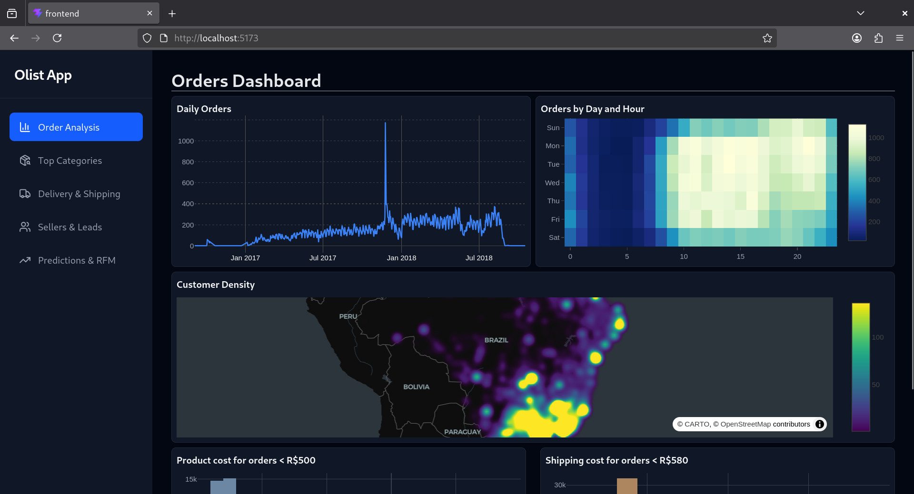

# Dashboard UI website
For Data Science! ...and web development too.

This dashboard website showcases featuring various top-level key preformance indicators (KPI) and prediction analysis work based on the data given in the O-List e-commerce dataset.



The website [olisteda.com](https://olisteda.com/) is deployed through Google Cloud Platform (GCP). The GCP uses a service runner that integrates Github's live CI/CD to use and run this respository itself.

Anything pushed to this repository (specifically the main branch) is automatically updated to the website.

## Building from source

See main repo: [github.com/kenmbo/olist-eda-dashboard](https://github.com/kenmbo/olist-eda-dashboard)
Contains instructions on getting the dataset, setting up the backend for data serving and

Installing from source requires nodejs's package manager `npm`. 
[npm installation steps](https://docs.npmjs.com/downloading-and-installing-node-js-and-npm)

```bash
git https://github.com/kenmbo/olist-eda-dashboard.git
cd olist-eda-dashboard/
cd frontend/

# Install depndencies
npm install react react-dom vite tailwindcss plotly.js-dist-min lucide-react
@tailwindcss/vite@next

# Run server
npm run dev

# Open localhost URL in the web browser of your choice (e.g. Firefox, Chrome, etc.)
# Default url: http://localhost:5173/

```

## React + TypeScript + Vite

This template provides a minimal setup to get React working in Vite with HMR and some ESLint rules.

Currently, two official plugins are available:

- [@vitejs/plugin-react](https://github.com/vitejs/vite-plugin-react/blob/main/packages/plugin-react) uses [Oxc](https://oxc.rs)
- [@vitejs/plugin-react-swc](https://github.com/vitejs/vite-plugin-react/blob/main/packages/plugin-react-swc) uses [SWC](https://swc.rs/)

## React Compiler

The React Compiler is not enabled on this template because of its impact on dev & build performances. To add it, see [this documentation](https://react.dev/learn/react-compiler/installation).

## Expanding the ESLint configuration

If you are developing a production application, we recommend updating the configuration to enable type-aware lint rules:

```js
export default defineConfig([
  globalIgnores(['dist']),
  {
    files: ['**/*.{ts,tsx}'],
    extends: [
      // Other configs...

      // Remove tseslint.configs.recommended and replace with this
      tseslint.configs.recommendedTypeChecked,
      // Alternatively, use this for stricter rules
      tseslint.configs.strictTypeChecked,
      // Optionally, add this for stylistic rules
      tseslint.configs.stylisticTypeChecked,

      // Other configs...
    ],
    languageOptions: {
      parserOptions: {
        project: ['./tsconfig.node.json', './tsconfig.app.json'],
        tsconfigRootDir: import.meta.dirname,
      },
      // other options...
    },
  },
])
```

You can also install [eslint-plugin-react-x](https://github.com/Rel1cx/eslint-react/tree/main/packages/plugins/eslint-plugin-react-x) and [eslint-plugin-react-dom](https://github.com/Rel1cx/eslint-react/tree/main/packages/plugins/eslint-plugin-react-dom) for React-specific lint rules:

```js
// eslint.config.js
import reactX from 'eslint-plugin-react-x'
import reactDom from 'eslint-plugin-react-dom'

export default defineConfig([
  globalIgnores(['dist']),
  {
    files: ['**/*.{ts,tsx}'],
    extends: [
      // Other configs...
      // Enable lint rules for React
      reactX.configs['recommended-typescript'],
      // Enable lint rules for React DOM
      reactDom.configs.recommended,
    ],
    languageOptions: {
      parserOptions: {
        project: ['./tsconfig.node.json', './tsconfig.app.json'],
        tsconfigRootDir: import.meta.dirname,
      },
      // other options...
    },
  },
])
```
